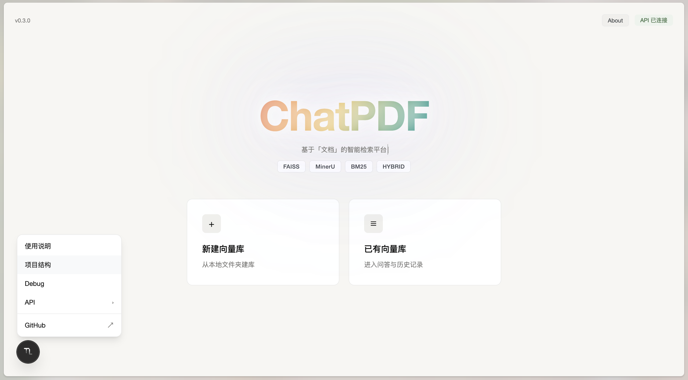
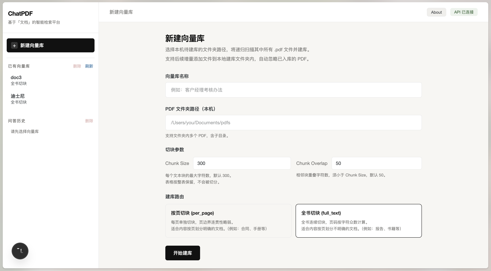
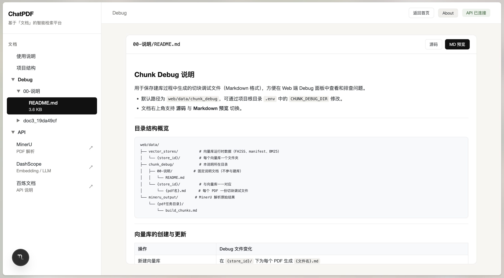
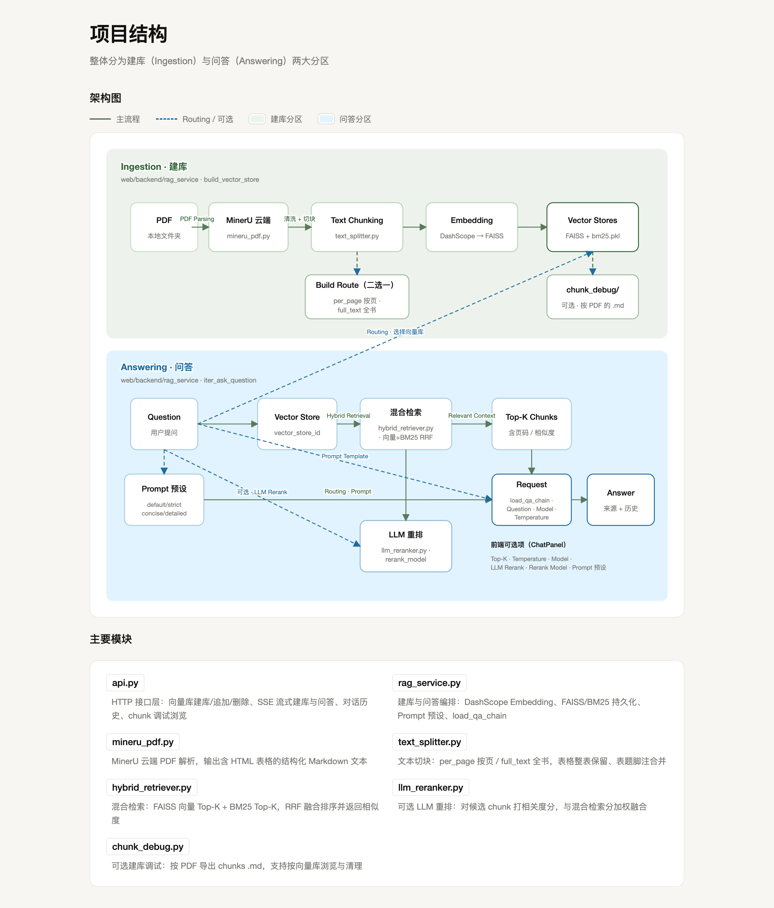

# ChatPDF

[](./LICENSE)

基于「文档」的智能检索平台 —— 上传 PDF 建库，混合检索 + 流式问答。



## 功能概览

- **PDF 建库**：本地文件夹批量导入，支持按页 / 全书两种切块策略
- **混合检索**：FAISS 向量 + BM25，RRF 融合，可选 LLM 重排
- **流式问答**：通义 / DeepSeek 模型，多预设 Prompt，带来源引用
- **Debug 面板**：建库切块 Markdown 可视化，便于排查检索效果

## 技术栈

| 模块 | 技术 |
|------|------|
| PDF 解析 | [MinerU](https://mineru.net) 云端 API |
| Embedding / LLM | [DashScope](https://dashscope.console.aliyun.com/) |
| 向量检索 | FAISS + BM25 混合检索 |
| 后端 | FastAPI + LangChain |
| 前端 | Next.js 15 |

## 界面预览

**新建向量库**



**Debug 切块预览**



## 架构



```
PDF 文件夹 → MinerU 解析 → 切块 → DashScope Embedding → FAISS + BM25
                                              ↓
用户提问 → 混合检索 → (可选 LLM 重排) → LLM 流式回答 → 问答历史
```

## 快速开始

### 1. 环境配置

在项目根目录复制 `.env.example` 为 `.env`，填入：

- `DASHSCOPE_API_KEY` — Embedding 与 LLM
- `MINERU_API_KEY` — PDF 云端解析

### 2. 安装依赖

```bash
# Python 后端
pip install -r web/requirements.txt

# 前端
cd web/frontend && npm install
```

### 3. 启动服务

```bash
# 后端（项目根目录）
python -m uvicorn web.backend.api:app --host 127.0.0.1 --port 8000 --reload

# 前端
cd web/frontend && npm run dev
```

- 前端：http://localhost:3000
- 后端：http://127.0.0.1:8000

## 项目结构

```
ChatPDF/
├── web/
│   ├── backend/       # FastAPI + RAG 核心
│   ├── frontend/      # Next.js Web UI
│   └── data/          # 向量库、Debug 文件等运行时数据
├── doc1/ doc2/ doc3/  # 示例 PDF（本地测试用）
└── .env.example       # 环境变量模板
```

## 说明

- 当前版本：**v0.4.0**
- 暂不支持多模态及 PDF 以外格式
- 更详细的开发文档见 [`web/README.md`](./web/README.md)

## License

本项目采用 [MIT License](./LICENSE) 开源。
