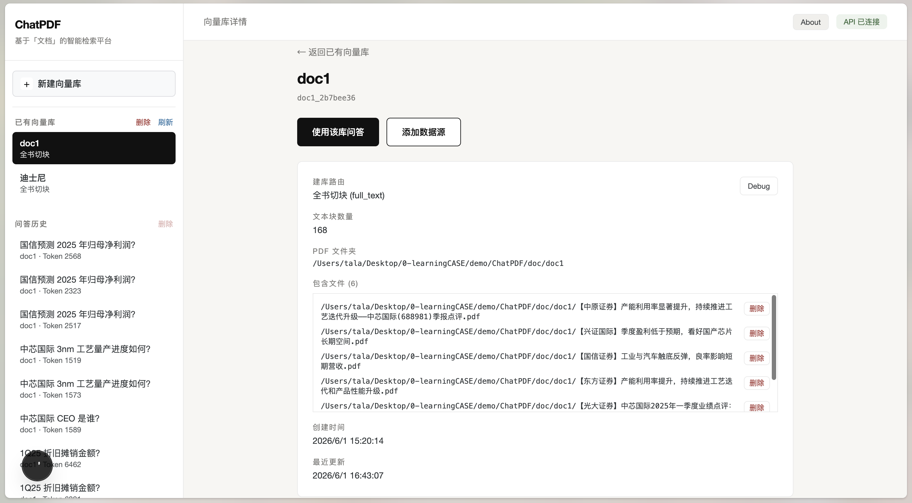
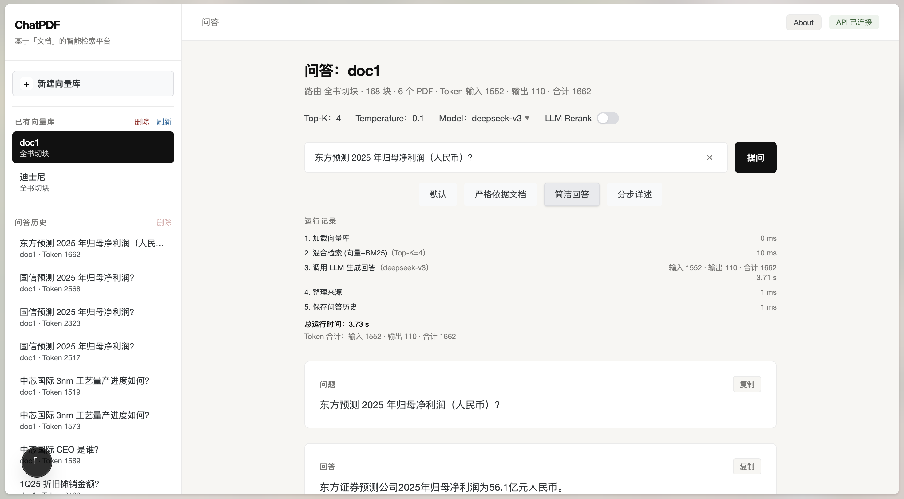
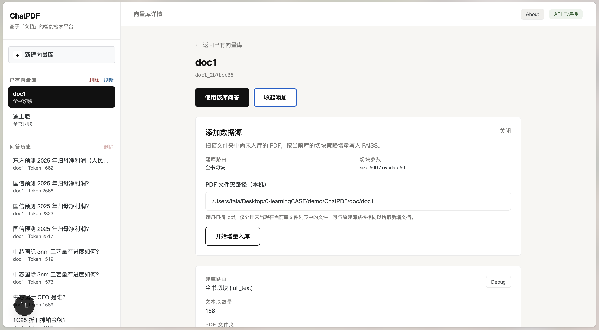

# ChatPDF

[](./LICENSE)

基于「文档」的智能检索平台


## 功能概览

- **PDF 建库**：本地文件夹批量导入；按页路由逐物理页、页内按 token 切分，全书路由连续按字符切分
- **混合检索**：FAISS 向量 + BM25，RRF 融合，可选 LLM 重排
- **流式问答**：通义 / DeepSeek 模型，多预设 Prompt，带来源引用
- **Debug 面板**：建库切块 Markdown 可视化，便于排查检索效果

## 技术栈

| 模块 | 技术 |
|------|------|
| PDF 解析 | [MinerU](https://mineru.net) 云端 API |
| Embedding / LLM | [DashScope](https://dashscope.console.aliyun.com/) |
| 向量检索 | FAISS + BM25 混合检索 |
| 后端 | FastAPI + LangChain |
| 前端 | Next.js 15 |

## 界面预览

**新建向量库**


**向量库详情**

- 支持知识库问答及数据源的增删功能。



**RAG 问答**



**增量更新数据库**



**Debug 预览**


## 架构


```
PDF 文件夹 → MinerU 解析 → 切块 → DashScope Embedding → FAISS + BM25
                                              ↓
用户提问 → 混合检索 → (可选 LLM 重排) → LLM 流式回答 → 问答历史
```

## 快速开始

### 1. 环境配置

在项目根目录复制 `.env.example` 为 `.env`，填入：

- `DASHSCOPE_API_KEY` — Embedding 与 LLM
- `MINERU_API_KEY` — PDF 云端解析

### 2. 安装依赖

```bash
# Python 后端
pip install -r web/requirements.txt

# 前端
cd web/frontend && npm install
```

### 3. 启动服务

```bash
# 后端（项目根目录）
python -m uvicorn web.backend.api:app --host 127.0.0.1 --port 8000 --reload

# 前端
cd web/frontend && npm run dev
```

- 前端：http://localhost:3000
- 后端：http://127.0.0.1:8000

## 项目结构

```
ChatPDF/
├── prompt/               # YAML Prompt 配置
│   ├── qa.yml            # 问答预设及模板
│   └── rerank.yml        # LLM 重排模板
├── web/
│   ├── backend/          # FastAPI + RAG 核心
│   ├── frontend/         # Next.js Web UI
│   └── data/             # 向量库、Debug 文件等运行时数据
├── image/                # README 界面与架构截图
├── test/                 # 后端定向测试
├── doc/                  # 示例 PDF（本地测试用）
└── .env.example          # 环境变量模板
```

## Prompt 配置

问答和重排 Prompt 不再写在 Python 文件中，统一由项目根目录 `prompt/` 下的 YAML 文件管理：

- `prompt/qa.yml`：维护 `default`、`strict`、`concise`、`detailed` 四种问答预设的标签和模板。
- `prompt/rerank.yml`：维护 LLM 检索重排模板。
- `web/backend/prompt_config.py`：启动时读取并校验 YAML；文件缺失、结构错误或缺少必要占位符时直接报错。

问答模板必须保留 `{context}`、`{question}`，重排模板必须保留 `{query}`、`{documents}`。

## 说明

- 当前版本：**v0.5.0**
- 暂不支持多模态及 PDF 以外格式
- 更详细的开发文档见 [`web/README.md`](./web/README.md)

## License

本项目采用 [MIT License](./LICENSE) 开源。
